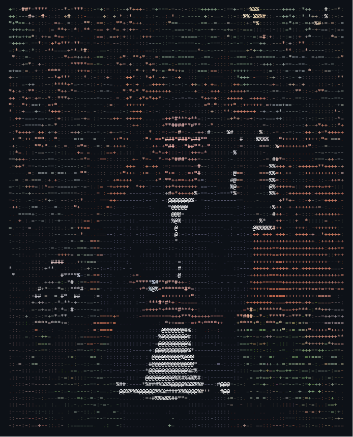

<div align="center">
  
<table border="0" width="100%">
  <tr>
    <td width="40%" align="center" valign="top">
      
    </td>
    <td width="60%" valign="top">

```yaml
Vanshdev3@github ------------------------------------------------
. Status: ....................................... Running (stable)
. Name: ............................................... Vansh Sail
. Uptime: ............................. 19 years, 1 month, 21 days
. Host: ......................................... Bangalore, India
. Role: ........................ Student, Cybersecurity Enthusiast
. OS: ................................................. Kali Linux
. Environment: .............................. Antigravity, VS Code
. Tools: ................. Git, Kali NetHunter, AWS, Azure, Docker

. Languages.Code: ................................. C, C++, Python
. Languages.Real: ...... English, Hindi, Konkani, Marathi, Kannada
. Interests: .................... Networking, CTFs, OSINT, Systems

- Contact -------------------------------------------------------
. Email.Personal: ........................ desainutan179@gmail.com
. Email.Work: .......................... PES2UG25CS707@stu.pes.edu
. LinkedIn: ........................................ in/vansh-sail
. Discord: ............................................... curatet

- GitHub Stats --------------------------------------------------
. Repos: ............. 1 {Contributed: 0} | Stars: ............ 0
. Commits: ............................ 2 | Followers: ........ 0
```

</td>
</tr>
</table>

<br>

</div>

### Tech Stack
<p align="left">
  
  
  
  
  
  
  
  
  
  
</p>

<div align="center">
  
</div>
